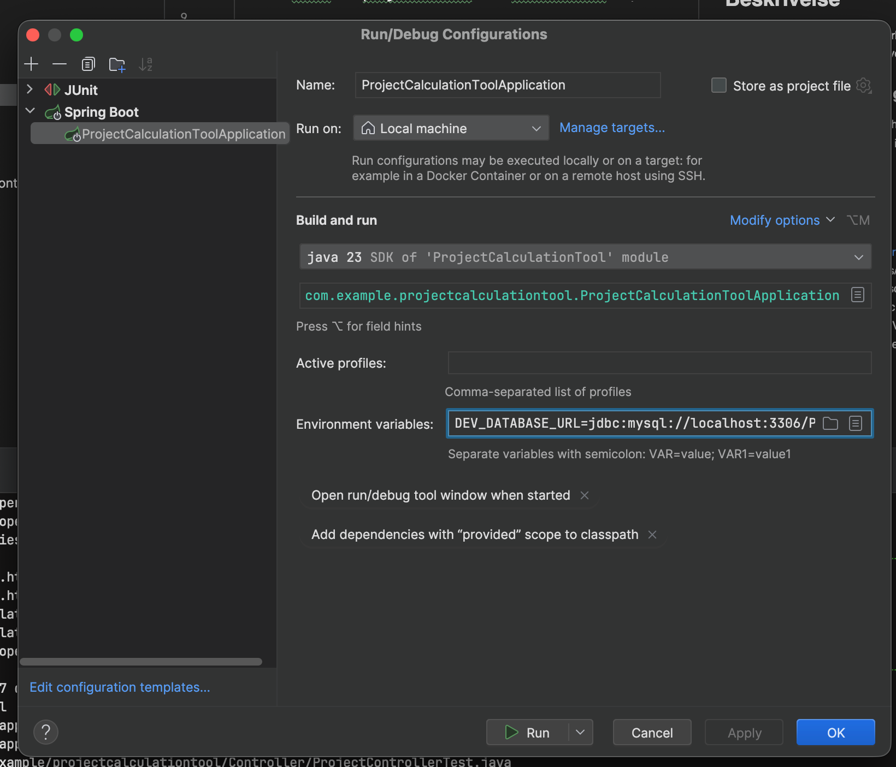

# ProjectCalculationTool 🧰

## Team 

- Peter Marbel, Niinyah, developer 🫃
- Philip raissnia, Silverspit, developer
- Josefine Hørlin, Josefinehoerlin, scrum master sprint 1
- Adam Hoppe, AdamHoppe98, developer

---
## Beskrivelse
Vi vil lavet et projektredskab til virksomheden Alpha Solutions, der skal gøre det let og overskuetligt at udregne hvor lang tid et projekt vil taget at lave. 

### Hvorfor er projektet brugbart
Det kan hjælpe med at estimere hvor lang tid et projekt cirka kommer til at tage og om det kan betale sig at byde ind på det. 

---

## 💾 Kør programmet lokalt 💾
 - clone repo ned i intellij  https://github.com/BugBust3rs/ProjectCalculationTool

 - kør SQL scriptet i filen "Docs/SQLTableCreator.sql" i din mySQLWorkbench eller andet sql værktøj
   - kør eventuelt populate scriptet i filen "Docs/SQLPopulate.sql"

 - '''DEV_DATABASE_URL=jdbc:mysql://localhost:3306/ProjectCalculationTool;DEV_USERNAME=PLACEHOLDER;DEV_PASSWORD=PLACEHOLDER'''

 - insæt ENV variabler under edit configurations... husk og erstatte PLACEHOLDER med dine egen password og med hvad din database hedder 

---
## 📂 Projektstruktur – Overblik

Dette projekt følger en klassisk Spring Boot MVC-arkitektur, opdelt i logiske lag for at skabe et struktureret, skalerbart
og let vedligeholdeligt system. Herunder findes en forklaring af de vigtigste mapper og deres ansvar.

## 📁 Controller
Indeholder alle MVC controllere, som håndterer HTTP-forespørgsler, validerer input og videresender data til views eller services.

## 📁 Repository
Dataadgangslaget. Står for CRUD-operationer og databasekommunikation

## 📁 Service
Forretningslogiklaget. Databehandling og koordinering mellem repository og controller.

## 📁 Model
Modeller som repræsenterer kerneobjekter i systemet.

## 📁 resources
Indeholder statiske filer, templates og standardkonfigurationer.

### 📁 static
style.css – global styling til HTML-views.

### 📁 templates
View-laget baseret på Thymeleaf. Indeholder HTML-skabeloner.

---